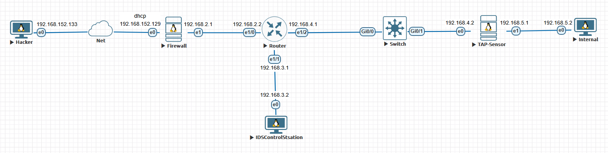

# Стенд - SOA

## Настройка статической маршрутизации

### Hacker
```yaml
sudo nano /etc/netplan/01-network-manager.yaml

# конфиг
network:
  version: 2
  ethernets:
    ens3: # интернет
      dhcp4: true

sudo netplan apply # применить
ping 8.8.8.8 # проверка
```

### Firewall
```yaml
nano /etc/netplan/00-installer-config.yaml

# конфиг
network:
  version: 2
  ethernets:
    ens3: # интернет
      dhcp4: true
    ens4: # IDS
      addresses: [192.168.2.1/24]
      routes:
        - to: 192.168.3.0/24 # Controll panel
          via: 192.168.2.2
        - to: 192.168.4.0/24 # Пользователь
          via: 192.168.2.2
        - to: 192.168.5.0/24 # Internal
          via: 192.168.2.2

sudo netplan apply # применить
ping 8.8.8.8 # проверка
```
```shell
# включаем ip forwarding
nano /etc/sysctl.conf
net.ipv4.ip_forward=1
net.ipv6.conf.all.forwarding=1
sysctl -p

# настриваем NAT и Разрешаем форвардинг
iptables -t nat -A POSTROUTING -s 192.168.0.0/16 -o ens3 -j MASQUERADE
iptables -P FORWARD ACCEPT
iptables -t nat -L -n -v

# Костыль для сохранения правил при перезагрзке
apt install iptables-persistent -y
netfilter-persistent save
```

### Router
```shell
enable
configure terminal
ip route 192.168.5.0 255.255.255.0 192.168.4.2
ip route 0.0.0.0 0.0.0.0 192.168.2.1

interface e1/0 # firewall
 ip address 192.168.2.2 255.255.255.0
 no shutdown
 exit

interface e1/1 # control panel
 ip address 192.168.3.1 255.255.255.0
 no shutdown
 exit

interface e1/2 # internal net
 ip address 192.168.4.1 255.255.255.0
 no shutdown
 exit

exit
copy running-config startup-config
```

### Control panel
```yaml
sudo nano /etc/netplan/01-network-manager.yaml

network:
  version: 2
  ethernets:
    ens3:
      addresses: [192.168.3.2/24]
      routes:
        - to: 0.0.0.0/0
          via: 192.168.3.1
      nameservers:
        addresses:
          - 8.8.8.8
sudo netplan apply
```

### TAP-Sensor
```yaml
nano /etc/netplan/00-installer-config.yaml

network:
  version: 2
  ethernets:
    ens3:
      addresses: [192.168.4.2/24]
      routes:
        - to: 0.0.0.0/0
          via: 192.168.4.1
      nameservers:
        addresses:
          - 8.8.8.8
    ens3:
      addresses: [192.168.5.1/24]

sudo netplan apply # применить
ping 8.8.8.8 # проверка
```
```shell
# включаем ip forwarding
nano /etc/sysctl.conf
net.ipv4.ip_forward=1
net.ipv6.conf.all.forwarding=1
sysctl -p

# настриваем NAT и Разрешаем форвардинг
iptables -t nat -A POSTROUTING -s 192.168.0.0/16 -o ens3 -j MASQUERADE
iptables -P FORWARD ACCEPT
iptables -t nat -L -n -v

# Костыль для сохранения правил при перезагрзке
apt install iptables-persistent -y
netfilter-persistent save
```

### Internal
```yaml
sudo nano /etc/netplan/01-network-manager.yaml

network:
  version: 2
  ethernets:
    ens3:
      addresses: [192.168.5.2/24]
      routes:
        - to: 0.0.0.0/0
          via: 192.168.5.1
      nameservers:
        addresses:
          - 8.8.8.8
sudo netplan apply
```

### Итого
* Статическая маршрутизация астроена
* CoolHacker может подключиться к Firewall для атаки
* По аналоги можно добавит аналогичные Internal подсети со своими TAP
* Топология сети:


## Настройка SOA

### Настройка Snort на TAP-Sensor
```shell
apt install -y snort
echo 'include custom.rules' >> /etc/snort/rules/snort.conf
echo 'output unified2: filename snort.u2, limit 128' >> /etc/snort/rules/snort.conf

vim /etc/snort/custom.rules
alert icmp any any -> $HOME_NET any (msg: "ICMP Ping Detected - Test rule"; itype: 8; sid: 1000001; rev: 1;)

# Проверка работоспособности snort
sudo snort -T -c /etc/snort/snort.conf
sudo snort -A console -q -c /etc/snort/snort.conf -i ens3

# Проверка что snort пишет в u2
sudo snort -c /etc/snort/snort.conf -i ens3
sudo u2spewfoo /var/log/snort/snort.u2.*
```

### Настройка Ansible на Control Panel для обновления правил Snort
* настройка ansible
```shell
sudo add-apt-repository --yes --update ppa:ansible/ansible
sudo apt install -y ansible

mkdir ansible && cd ansible
nano inventory.ini
[sensors]
sensor1 ansible_host=192.168.4.2 ansible_user=root

ansible -i inventory.ini snort_sensors -m ping
```
* написание playbook
```shell
nano default.rules
alert icmp any any -> $HOME_NET any (msg: "ICMP Ping Detected - Test rule"; itype: 8; sid: 1000001; rev: 1;)
```
```yml
nano update_rules.yml
---
- name: Update Snort rules on sensors
  hosts: snort_sensors
  become: true
  vars:
    local_rule: default.rules
    remote_rule: /etc/snort/custom.rules
  tasks:
    - name: Copy new rules to sensor
      copy:
        src: "{{ local_rule }}"
        dest: "{{ remote_rule }}"
    - name: check rules
      command: snort -T -c /etc/snort/snort.conf
    - name: restart snort
      systemd:
        name: snort
        state: restarted
        enabled: yes

ansible-playbook -i inventory.ini update_rules.yml -v
```

### Настройка визуализации логов на Control Panel для просмотра сработок Snort
#### Настройка MySQL на Control Panel
* Настройка БД на Control Panel
```shell
sudo apt update
sudo apt install -y mysql-server
sudo mysql_secure_installation
```
```shell
sudo nano /etc/mysql/mysql.conf.d/mysqld.cnf
bind-address = 0.0.0.0
sudo systemctl restart mysql
```
```shell
sudo mysql -u root -p

CREATE DATABASE snort;
CREATE USER 'snort'@'192.168.4.2' IDENTIFIED BY 'snort_password';
GRANT ALL PRIVILEGES ON snort.* TO 'snort'@'192.168.4.2';
CREATE USER 'snort'@'localhost' IDENTIFIED BY 'snort_password';
GRANT ALL PRIVILEGES ON snort.* TO 'snort'@'localhost';
FLUSH PRIVILEGES;
EXIT;
```
```shell
wget https://raw.githubusercontent.com/firnsy/barnyard2/master/schemas/create_mysql
sudo mysql -u root -p snort < create_mysql
```
* проверка с TAP
```shell
mysql -h 192.168.3.2 -u snort -p
SHOW DATABASES;
USE snort;
SHOW TABLES;
```

#### Настройка barnyard на TAP-Sensor
* сборка barnyard2 из исходников
```shell
sudo apt install -y build-essential libpcap-dev libpcre3-dev \
                     libdumbnet-dev libmysqlclient-dev \
                     autoconf automake libtool flex bison

wget https://github.com/firnsy/barnyard2/archive/refs/tags/v2-1.13.tar.gz
tar -xzvf v2-1.13.tar.gz
cd barnyard2-2-1.13

./autogen.sh
./configure --with-mysql-libraries=/usr/lib/x86_64-linux-gnu --disable-fwsam
# закоментировал typedef int SOCKET; в src/output-plugins/spo_alert_fwsam.c
# исправил src/output-plugins/spo_database.h: my_bool -> bool
make
sudo make install
```
* настройка barnyard2
```shell
sudo nano /etc/snort/barnyard2.conf

config hostname: sensor1
config interface: ens3
config classification_file: /etc/snort/classification.config
config sid_file: /etc/snort/sid-msg.map
output database: log, mysql, user=snort password=snort_password dbname=snort host=192.168.3.2

touch /etc/snort/classification.config
touch /var/log/snort/barnyard2.waldo
echo '1000001 || ICMP Ping Detected - Test rule' > /etc/snort/sid-msg.map

sudo barnyard2 -c /etc/snort/barnyard2.conf -d /var/log/snort -f snort.u2 -w /var/log/snort/barnyard2.waldo
```