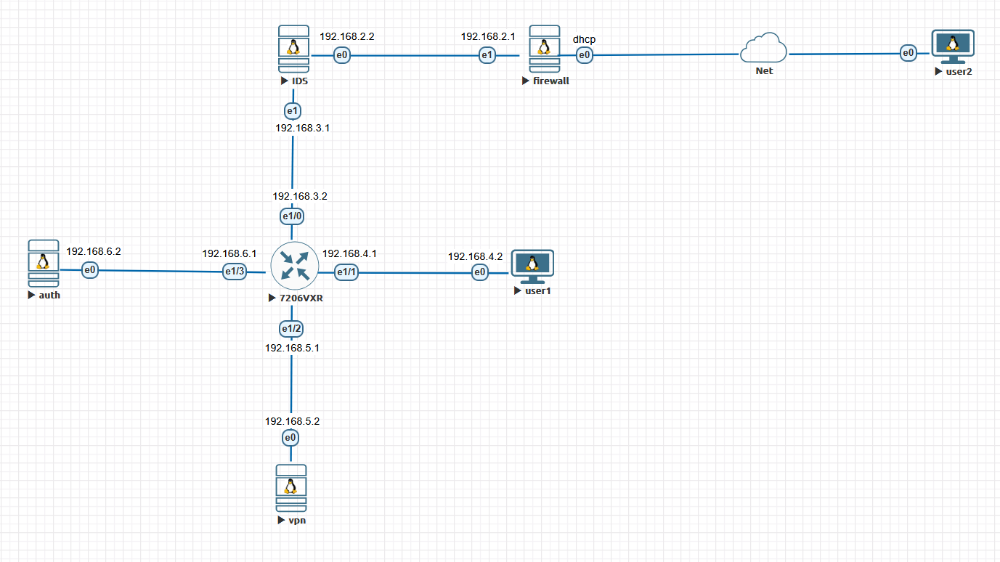

# Стенд ГИС

Требуется построить сеть государственной информационной системы:
* Статическая маршрутизация
* WireGuard для доступа к внутренней сети из внешней
* FreeRadius + Squid для доступа к внешней сети из внутренней
* Snort в роли IDS
* UFW - межсетевой экран 

## Настройка статической маршрутизации

### Firewall линукс сервер с выходом в интернет:
Функции
* Межсетевой экран
* Зеркалирование трафика на IDS сервер
* Статическая маршрутизация
```shell
nano /etc/netplan/00-installer-config.yaml

# конфиг
network:
  version: 2
  ethernets:
    ens3: # интернет
      dhcp4: true
    ens4: # IDS
      addresses: [192.168.2.1/24]
      routes:
        - to: 192.168.3.0/24 # Маршрутизатор
          via: 192.168.2.2
        - to: 192.168.4.0/24 # Пользователь
          via: 192.168.2.2
        - to: 192.168.5.0/24 # VPN
          via: 192.168.2.2
        - to: 192.168.6.0/24 # Auth
          via: 192.168.2.2

sudo netplan apply # применить
ping 8.8.8.8 # проверка

# включаем ip forwarding
nano /etc/sysctl.conf
net.ipv4.ip_forward=1
net.ipv6.conf.all.forwarding=1
sysctl -p

# настриваем NAT и Разрешаем форвардинг
iptables -t nat -A POSTROUTING -s 192.168.0.0/16 -o ens3 -j MASQUERADE
iptables -P FORWARD ACCEPT
iptables -t nat -L -n -v

# Костыль для сохранения правил при перезагрзке
apt install iptables-persistent -y
netfilter-persistent save
```

### IDS сервер
```shell
nano /etc/netplan/00-installer-config.yaml

network:
  version: 2
  ethernets:
    ens3:
      addresses: [192.168.2.2/24]
      routes:
        - to: 0.0.0.0/0
          via: 192.168.2.1
      nameservers:
        addresses:
          - 8.8.8.8
    ens4:
      addresses: [192.168.3.1/24]
      routes:
        - to: 192.168.4.0/24
          via: 192.168.3.2
        - to: 192.168.5.0/24
          via: 192.168.3.2
        - to: 192.168.6.0/24
          via: 192.168.3.2

netplan apply

# включаем ip forwarding
nano /etc/sysctl.conf
net.ipv4.ip_forward=1
net.ipv6.conf.all.forwarding=1
sysctl -p
```

### маршрутизатор в пользовательской сети
* обеспечивает связность устройств во внутренней сети
```shell
enable
configure terminal
ip route 0.0.0.0 0.0.0.0 192.168.3.1

interface e1/0 # firewall
 ip address 192.168.3.2 255.255.255.0
 no shutdown
 exit

interface e1/1 # пользователь
 ip address 192.168.4.1 255.255.255.0
 no shutdown
 exit

interface e1/2 # vpn
 ip address 192.168.5.1 255.255.255.0
 no shutdown
 exit

interface e1/3 # auth
 ip address 192.168.6.1 255.255.255.0
 no shutdown
 exit

exit
copy running-config startup-config
```

### Пользователь
* имитирует пользователя внутренней сети
```shell
sudo nano /etc/netplan/01-network-manager.yaml

network:
  version: 2
  ethernets:
    ens3:
      addresses: [192.168.4.2/24]
      routes:
        - to: 0.0.0.0/0
          via: 192.168.4.1
      nameservers:
        addresses:
          - 8.8.8.8
sudo netplan apply
```

### VPN сервер
* обеспечивает доступ к ресурсам внутренней сети из внешней сети
```shell
nano /etc/netplan/00-installer-config.yaml

network:
  version: 2
  ethernets:
    ens3:
      addresses:
        - 192.168.5.2/24  
      routes:
        - to: 0.0.0.0/0
          via: 192.168.5.1
      nameservers:
        addresses:
          - 8.8.8.8

netplan apply
```

### Auth сервер
* Обеспечивает доступ к внешней сети из внутренней по реквизитам
```shell
nano /etc/netplan/00-installer-config.yaml

network:
  version: 2
  ethernets:
    ens3:
      addresses:
        - 192.168.6.2/24  
      routes:
        - to: 0.0.0.0/0
          via: 192.168.6.1
      nameservers:
        addresses:
          - 8.8.8.8

netplan apply
```

## Установка и настройка ПО
### WireGuard
* VPN будет крутиться в docker контейнере wg-easy с красивым веб интерфейсом
* специально для этого указали dns
```shell
curl -sSL https://get.docker.com | sh
mkdir -p /etc/docker/containers/wg-easy
cd /etc/docker/containers/wg-easy
curl -o ./docker-compose.yml https://raw.githubusercontent.com/wg-easy/wg-easy/master/docker-compose.yml
nano docker-compose.yml
docker compose up -d
```
* изменения в docker compose
```
enviroment:
- INSECURE=true
- WG_ALLOWED_IPS=192.168.0.0/16  
```
* Проверяем на user1
* Веб интерфейс по адресу 192.168.5.2:51821
* (root/Test123Test123)
* Подключаем клиента по конфигу
```shell
sudo apt update
sudo apt install wireguard resolvconf -y
sudo cp ~/Downloads/user1.conf /etc/wireguard/wg0.conf
sudo wg-quick up wg0 # поднимаем интерфейс
sudo wg show # статистика
sudo systemctl enable wg-quick@wg0 # автозапуск
```
* Теперь нужно прокинуть порт до vpn сервера
```shell
iptables -t nat -A PREROUTING -i ens3 -p udp --dport 51820 -j DNAT --to-destination 192.168.5.2:51820
iptables -t nat -A PREROUTING -i ens3 -p tcp --dport 51821 -j DNAT --to-destination 192.168.5.2:51821 # это костыль чтобы выкачать конфиг
iptables -t nat -L -n -v
netfilter-persistent save
```
* также меняем ip сервера на тот что в dhcp
* можем в автозапуск добавить
* проверим работоспособность постучавшись в веб интерфейс изнутри (10.8.0.1)
```shell
sudo apt update
sudo apt install wireguard resolvconf -y
sudo cp ~/Downloads/user1.conf /etc/wireguard/wg0.conf
sudo nano /etc/wireguard/wg0.conf
sudo wg-quick up wg0
ping 10.8.0.1
sudo wg show
```
### Snort
* Ставим и настраиваем snort
* опять придется удить процесс занявший пакетный менеджер
```shell
apt install -y snort
nano /etc/snort/custom.rule
alert icmp any any -> any any (msg:"ICMP: Ping Detected"; itype:8; sid:1000100; rev:1;)
snort -A console -q -c /etc/snort/custom.rule
```
### FreeRadius + Squid
* настройка FreeRadius сервера
```shell
apt install -y freeradius freeradius-utils
```
```shell
nano /etc/freeradius/3.0/clients.conf
client localhost {
    ipaddr = 127.0.0.1
    secret = user1_secret
}
client auth-server {
    ipaddr = 192.168.6.2
    secret = user1_secret
}
client user1 {
    ipaddr = 192.168.4.2
    secret = user1_secret
}
```
```shell
nano /etc/freeradius/3.0/users
user1 Cleartext-Password := "user1pass"
    Reply-Message = "Welcome, User1!"
    Session-Timeout = 120 
```
```shell
systemctl restart freeradius
systemctl status freeradius
radtest user1 user1pass 127.0.0.1 0 user1_secret -t 3
```
```shell
apt install -y squid squid-common
#htpasswd -c /etc/squid/passwords user1
nano /etc/squid/squid.conf

http_port 3129
visible_hostname auth-proxy
cache_dir ufs /var/spool/squid 100 16 256

auth_param basic program /usr/lib/squid/basic_ncsa_auth /etc/squid/passwords
#auth_param basic program /usr/lib/squid/basic_radius_auth -h 127.0.0.1 -p 1812 -w user1_secret -t 3
auth_param basic children 5
auth_param basic realm "STAND GIS"
auth_param basic credentialsttl 120 seconds

acl user1 src 192.168.4.2/32
acl authenticated proxy_auth REQUIRED

http_access allow authenticated user1
http_access deny all

squid -k parse
systemctl restart squid
```
* Настройка клиента
```shell
sudo apt update
sudo apt install -y freeradius-utils
curl http://www.google.com
radtest user1 user1pass 192.168.6.2 0 user1_secret
curl --proxy http://192.168.6.2:3129 --proxy-user user1:user1pass http://www.google.com
```
* Настройка маршрутизации
```shell
enable
configure terminal

ip access-list extended block-direct-access
 deny   tcp host 192.168.4.2 any eq 80
 deny   tcp host 192.168.4.2 any eq 443
 permit tcp host 192.168.4.2 host 192.168.6.2 eq 3129
 permit ip any any

interface e1/1
 ip access-group block-direct-access in
 exit

copy running-config startup-config
```
* Проверка
```shell
curl http://www.google.com
radtest user1 user1pass 192.168.6.2 0 user1_secret
curl --proxy http://192.168.6.2:3129 --proxy-user user1:user1pass http://www.google.com
```
### Межсетевой экран
* Настройка Firewall
```shell
apt update
apt install -y ufw
ufw --force reset
ufw default allow outgoing
ufw default deny incoming
ufw allow in on ens3 proto udp to any port 51820
ufw allow in on ens3 from any to any port 1024:65535 proto tcp
ufw enable
ufw status numbered
```

### Итого
* Топология сети:
